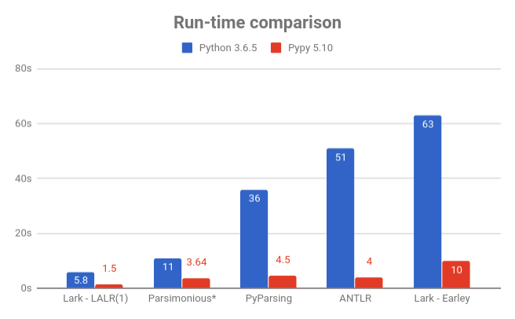
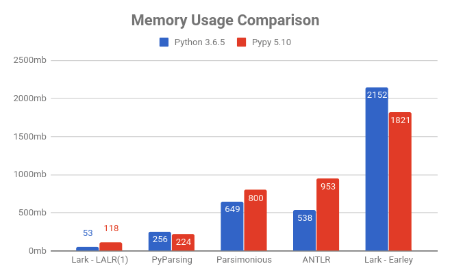

# Lark - a modern parsing library for Python

Parse any context-free grammar, FAST and EASY!

**Beginners**: Lark is not just another parser. It can parse any grammar you throw at it, no matter how complicated or ambiguous, and do so efficiently. It also constructs a parse-tree for you, without additional code on your part.

**Experts**: Lark lets you choose between Earley and LALR(1), to trade-off power and speed. It also contains a CYK parser and unique features such as a contextual-lexer.

Lark can:

 - Parse all context-free grammars, and handle all ambiguity
 - Build a parse-tree automagically, no construction code required
 - Outperform all other Python libraries when using LALR(1) (Yes, including PLY)
 - Run on every Python interpreter (it's pure-python)
 - Generate a stand-alone parser (for LALR(1) grammars)

And many more features. Read ahead and find out.

Most importantly, Lark will save you time and prevent you from getting parsing headaches.

### Quick links

- [Documentation @readthedocs](https://lark-parser.readthedocs.io/)
- [Tutorial](/docs/json_tutorial.md) for writing a JSON parser.
- [Cheatsheet (PDF)](/docs/lark_cheatsheet.pdf)
- Blog post: [How to write a DSL with Lark](http://blog.erezsh.com/how-to-write-a-dsl-in-python-with-lark/)
- [Forum @googlegroups](https://groups.google.com/forum/#!forum/lark-parser)
- [Gitter chat](https://gitter.im/lark-parser/Lobby) (New)

### Install Lark

    $ pip install lark-parser

Lark has no dependencies.

[](https://travis-ci.org/lark-parser/lark)

### Syntax Highlighting (new)

Lark now provides syntax highlighting for its grammar files (\*.lark):

- [Sublime Text & TextMate](https://github.com/lark-parser/lark_syntax)
- [vscode](https://github.com/lark-parser/vscode-lark)


### Hello World

Here is a little program to parse "Hello, World!" (Or any other similar phrase):

```python
from lark import Lark

l = Lark('''start: WORD "," WORD "!"

            %import common.WORD   // imports from terminal library
            %ignore " "           // Disregard spaces in text
         ''')

print( l.parse("Hello, World!") )
```

And the output is:

```python
Tree(start, [Token(WORD, 'Hello'), Token(WORD, 'World')])
```

Notice punctuation doesn't appear in the resulting tree. It's automatically filtered away by Lark.

### Fruit flies like bananas

Lark is great at handling ambiguity. Let's parse the phrase "fruit flies like bananas":


See more [examples in the wiki](https://github.com/erezsh/lark/wiki/Examples)


## List of main features

 - Builds a parse-tree (AST) automagically, based on the structure of the grammar
 - **Earley** parser
    - Can parse all context-free grammars
    - Full support for ambiguous grammars
 - **LALR(1)** parser
    - Fast and light, competitive with PLY
    - Can generate a stand-alone parser
 - **CYK** parser, for highly ambiguous grammars (NEW! Courtesy of [ehudt](https://github.com/ehudt))
 - **EBNF** grammar
 - **Unicode** fully supported
 - **Python 2 & 3** compatible
 - Automatic line & column tracking
 - Standard library of terminals (strings, numbers, names, etc.)
 - Import grammars from Nearley.js
 - Extensive test suite [](https://codecov.io/gh/erezsh/lark)
 - And much more!

See the full list of [features in the wiki](https://github.com/erezsh/lark/wiki/Features)


### Comparison to other libraries

#### Performance comparison

Lark is the fastest and lightest (lower is better)






Check out the [JSON tutorial](/docs/json_tutorial.md#conclusion) for more details on how the comparison was made.

*Note: I really wanted to add PLY to the benchmark, but I couldn't find a working JSON parser anywhere written in PLY. If anyone can point me to one that actually works, I would be happy to add it!*

#### Feature comparison

| Library | Algorithm | Grammar | Builds tree? | Supports ambiguity? | Can handle every CFG? | Line/Column tracking | Generates Stand-alone
|:--------|:----------|:----|:--------|:------------|:------------|:----------|:----------
| **Lark** | Earley/LALR(1) | EBNF | Yes! | Yes! | Yes! | Yes! | Yes! (LALR only) |
| [PLY](http://www.dabeaz.com/ply/) | LALR(1) | BNF | No | No | No | No | No |
| [PyParsing](http://pyparsing.wikispaces.com/) | PEG | Combinators | No | No | No\* | No | No |
| [Parsley](https://pypi.python.org/pypi/Parsley) | PEG | EBNF | No | No | No\* | No | No |
| [funcparserlib](https://github.com/vlasovskikh/funcparserlib) | Recursive-Descent | Combinators | No | No | No | No | No |
| [Parsimonious](https://github.com/erikrose/parsimonious) | PEG | EBNF | Yes | No | No\* | No | No |
| [ANTLR](https://github.com/antlr/antlr4) | LL(*) | EBNF | Yes | No | Yes? | Yes | No |


(\* *PEGs cannot handle non-deterministic grammars. Also, according to Wikipedia, it remains unanswered whether PEGs can really parse all deterministic CFGs*)


### Projects using Lark

 - [mappyfile](https://github.com/geographika/mappyfile) - a MapFile parser for working with MapServer configuration
 - [pytreeview](https://gitlab.com/parmenti/pytreeview) - a lightweight tree-based grammar explorer
 - [tartiflette](https://github.com/dailymotion/tartiflette) - a GraphQL engine by Dailymotion (Lark is used to parse the GraphQL schemas definitions)

Using Lark? Send me a message and I'll add your project!

### How to use Nearley grammars in Lark

Lark comes with a tool to convert grammars from [Nearley](https://github.com/Hardmath123/nearley), a popular Earley library for Javascript. It uses [Js2Py](https://github.com/PiotrDabkowski/Js2Py) to convert and run the Javascript postprocessing code segments.

Here's an example:
```bash
git clone https://github.com/Hardmath123/nearley
python -m lark.tools.nearley nearley/examples/calculator/arithmetic.ne main nearley > ncalc.py
```

You can use the output as a regular python module:

```python
>>> import ncalc
>>> ncalc.parse('sin(pi/4) ^ e')
0.38981434460254655
```


## License

Lark uses the [MIT license](LICENSE).

## Contribute

Lark is currently accepting pull-requests.

There are many ways you can help the project:

* Help solve issues
* Improve the documentation
* Write new grammars for Lark's library
* Write a blog post introducing Lark to your audience
* Port Lark to another language
* Help me with code developemnt

If you're interested in taking one of these on, let me know and I will provide more details and assist you in the process.

## Donate

If you like Lark and feel like donating, you can do so at my [patreon page](https://www.patreon.com/erezsh).

If you wish for a specific feature to get a higher priority, you can request it in a follow-up email, and I'll consider it favorably.

## Contact

If you have any questions or want my assistance, you can email me at erezshin at gmail com.

I'm also available for contract work.

 -- [Erez](https://github.com/erezsh)
